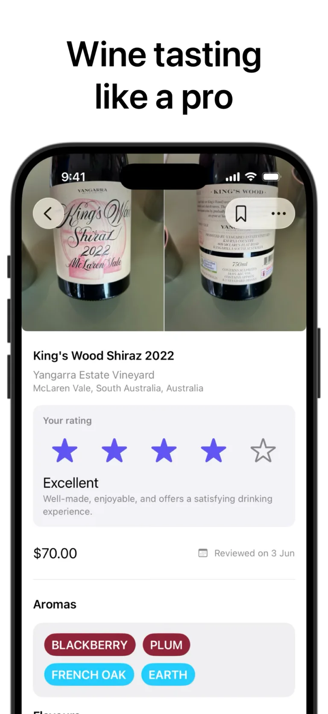
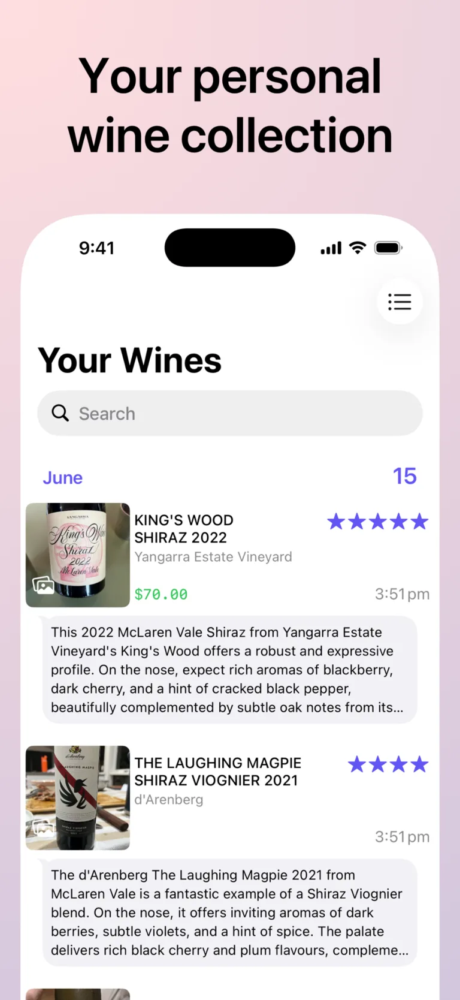

# Image Optimization Workflow

This document explains how the gotBottle website images were compressed, how to reproduce the results, and how to validate future updates.

## Tools

- [Homebrew](https://brew.sh/) for installing the encoder
- `cwebp` 1.6.0 from Google's WebP tools for resizing and compression
- `sips` (included with macOS) for checking image dimensions
- `du` and `stat` for measuring file sizes
- A browser with DevTools or Playwright for request and layout validation

## Current Strategy

The original PNG files remain in `assets/img/` as full-resolution source files and crawler-facing structured-data images. The website serves smaller WebP files for visible UI images.

| Asset | Source | Display output | Settings |
| --- | --- | --- | --- |
| App Store screenshots | 921 x 2000 PNG | 768 x 1668 WebP | Quality 82 |
| App icon | 1024 x 1024 PNG | 256 x 256 WebP | Quality 88 |

The screenshot width of 768 pixels is sufficient for the site's largest rendered screenshot at approximately 386 CSS pixels on a 2x display.

## Step 1: Install the Encoder

On macOS:

```sh
brew install webp
```

Verify the installed version:

```sh
/opt/homebrew/opt/webp/bin/cwebp -version
```

The images currently in the repository were generated with `cwebp` 1.6.0.

### Homebrew Troubleshooting

If `cwebp` reports a missing `libtiff.6.dylib`, install the missing runtime dependency:

```sh
brew install libtiff
```

If `cwebp` is not available on the shell `PATH`, use its Homebrew path directly:

```sh
/opt/homebrew/opt/webp/bin/cwebp
```

On an Intel Mac, Homebrew may use `/usr/local/opt/webp/bin/cwebp` instead.

## Step 2: Confirm Source Dimensions

Run this before encoding newly downloaded screenshots:

```sh
sips -g pixelWidth -g pixelHeight \
  assets/img/appstore-{1,2,3,4,5,6,7}.png \
  assets/img/app_icon.png
```

Expected source dimensions:

- Screenshots: 921 x 2000 pixels
- App icon: 1024 x 1024 pixels

If Apple changes the source dimensions, recalculate the output size instead of blindly using the existing values.

## Step 3: Encode the Screenshots

From the repository root:

```sh
encoder=/opt/homebrew/opt/webp/bin/cwebp

for source in assets/img/appstore-{1,2,3,4,5,6,7}.png; do
  "$encoder" \
    -quiet \
    -mt \
    -q 82 \
    -resize 768 0 \
    "$source" \
    -o "${source%.png}.webp"
done
```

Options used:

- `-quiet`: suppresses per-image encoder output
- `-mt`: enables multithreaded encoding
- `-q 82`: balances screenshot text clarity and file size
- `-resize 768 0`: sets width to 768 pixels and preserves aspect ratio

## Step 4: Encode the App Icon

```sh
encoder=/opt/homebrew/opt/webp/bin/cwebp

"$encoder" \
  -quiet \
  -mt \
  -q 88 \
  -resize 256 256 \
  assets/img/app_icon.png \
  -o assets/img/app_icon.webp
```

The icon uses a slightly higher quality setting because its gradients and edges are prominent, while 256 x 256 pixels still provides more than enough resolution for its maximum 112 x 112 CSS-pixel display size.

## Step 5: Compare File Sizes

Check aggregate source and output sizes:

```sh
du -ch assets/img/appstore-*.png assets/img/app_icon.png | tail -1
du -ch assets/img/appstore-*.webp assets/img/app_icon.webp | tail -1
```

Results from the current assets:

- PNG sources: 6.1 MB
- WebP display assets: 468 KB
- Overall reduction: approximately 92%

Individual results:

| Asset | PNG | WebP | Reduction |
| --- | ---: | ---: | ---: |
| `appstore-1` | 914,492 B | 78,304 B | 91.4% |
| `appstore-2` | 346,312 B | 57,436 B | 83.4% |
| `appstore-3` | 1,174,194 B | 71,932 B | 93.9% |
| `appstore-4` | 659,233 B | 51,458 B | 92.2% |
| `appstore-5` | 591,498 B | 44,978 B | 92.4% |
| `appstore-6` | 1,813,206 B | 119,564 B | 93.4% |
| `appstore-7` | 314,481 B | 35,714 B | 88.6% |
| `app_icon` | 589,229 B | 3,060 B | 99.5% |

## Step 6: Update Website References

Visible images in `index.html` should reference `.webp` files:

```html

```

For below-the-fold gallery images, retain lazy loading and asynchronous decoding:

```html

```

Keep explicit `width` and `height` attributes. They reserve the correct aspect ratio before download and reduce layout shift.

The full-resolution PNG URLs may remain in Schema.org structured data because crawlers and social services benefit from durable, high-resolution source images.

## Step 7: Validate Quality and Behavior

### Visual quality

Inspect at least these representative images at full size:

- `appstore-1.webp` for small light-interface text
- `appstore-5.webp` for dark gradients and contrast
- `appstore-6.webp` for map labels and fine detail
- `app_icon.webp` for edge and gradient quality

Look for blurred text, color banding, ringing around letters, and map-label artifacts. Increase `-q` in increments of 3 if degradation is visible.

### Browser behavior

Reload with the browser cache disabled and verify:

1. Visible image requests use `.webp` files.
2. No visible image request returns an error.
3. The page has no horizontal overflow.
4. Screenshot dimensions preserve the expected aspect ratio.
5. Below-the-fold images retain `loading="lazy"`.
6. The hero's main screenshot uses `fetchpriority="high"`.
7. Desktop and mobile layouts remain unchanged.

### Repository checks

```sh
git diff --check
git status --short
```

## Updating Screenshots Later

When App Store screenshots change:

1. Replace the numbered PNG source files with the new full-resolution images.
2. Confirm their dimensions with `sips`.
3. Re-run the WebP screenshot encoding loop.
4. Update HTML `width` and `height` values if the aspect ratio changed.
5. Compare sizes and visually inspect representative outputs.
6. Test desktop and mobile rendering with the browser cache disabled.
7. Commit both the new PNG sources and WebP display assets.
